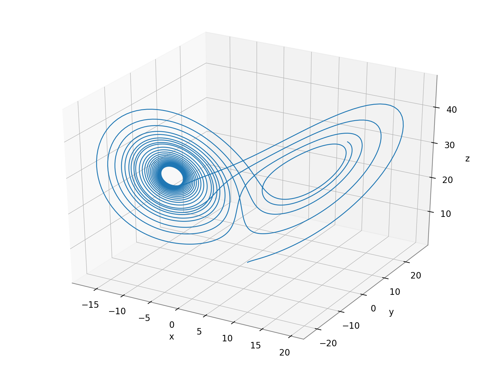
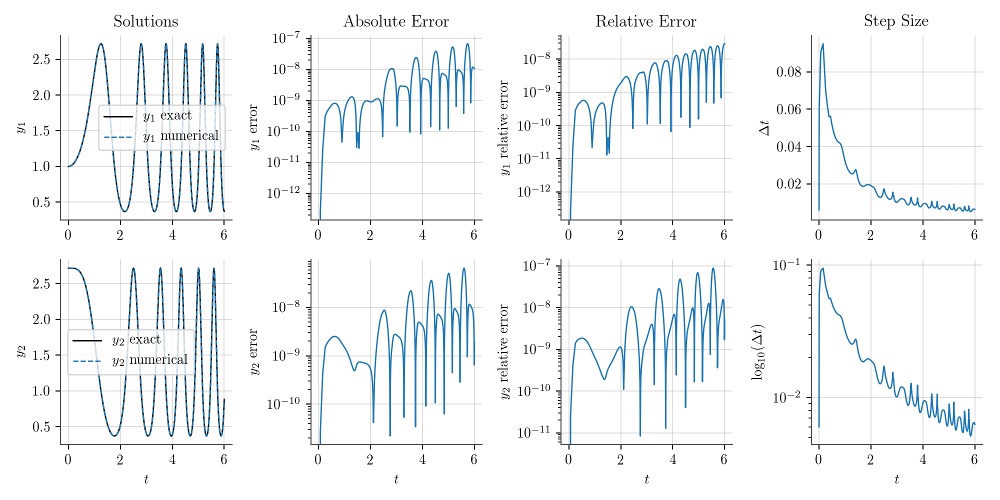
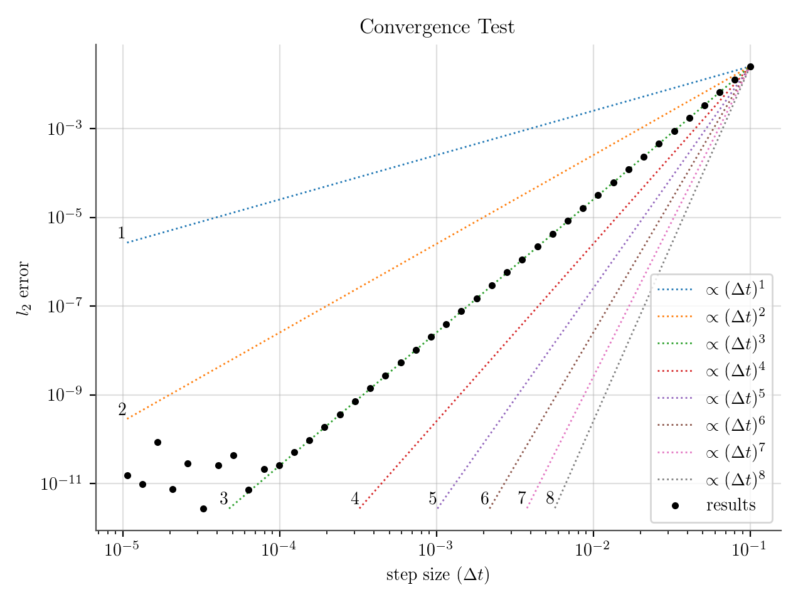

# libode

This repo contains a collection of C++ and Python classes for solving systems of ordinary differential equations (ODEs). All of the solvers are explict, single-step, Runge-Kutta methods. Also included in this repository are a few programs to test the behavior of different solvers. Each solver can be used with a fixed time step and several of them are embedded Runge-Kutta methods with adaptive time step selection. Some of the methods also take advantage of the first-same-as-last (FSAL) property.

The C++ classes were originally styled after Chris Rycroft's [example classes](https://github.com/chr1shr/am225_examples/tree/master/1a_ode_solvers) and have mostly been used to handle the temporal discretization in systems of PDEs (the [method of lines](https://en.wikipedia.org/wiki/Method_of_lines) approach). Their modularity makes it easy to switch between various methods, their structure as classes makes it simple to build programs on top of them, and compiling everything should be a cinch.

The Python classes are not easier to use or faster than [scipy's classes](https://docs.scipy.org/doc/scipy/reference/integrate.html). They have been useful, however, for demonstrating the behavior of different methods and testing some aspects of the solvers before implementing them in C++. If, for whatever reason, you need an explicit solver with higher order than those available from scipy, 6th and 8th order methods are implemented here as Python classes.

Several of the solvers and much more detail on the methods can be found in this amazing book:
* Hairer, E., Nørsett, S.P. and Wanner, G., 1991. *Solving ordinary differential equations. 1, Nonstiff problems*. Springer-Vlg.

## Using the Solvers

#### C++

To use a C++ solver, a new class must be created to inherit from one of the solver classes. This new inheriting class must
1. Define the system of ODEs to be solved by implementing the `ode_funk` function. This is a virtual function in the base classes. Once it is implemented, it can be used by the stepping and solving functions.
2. Set initial conditions in the `sol` variable, which is an array with the same length as the system of ODEs.

Other than defining the system of equations and setting initial conditions, the derived class can store whatever information and implement whatever other methods are necessary. This could be something simple like an extra function for setting initial conditions. It could, however, comprise any other system that needs to run on top of an ODE solver, like the spatial discretization of a big PDE solver.

Some simple systems of two ODEs, which have been used to test convergence and accuracy, are implemented [here](test/cpp/ode_explicit_test_systems.hpp) if examples are useful. A template class is also provided [here](TemplateSolver.cpp) with a `main` function to drive it.

Each solver class has a `solve_fixed` method and, if it's an adaptive class, a `solve_adaptive` method. These functions return nothing and both have three call signatures.
* `void solve_fixed (double tend, double dt)`
* `void solve_fixed (double tend, double dt, const char *dirout)`
* `void solve_fixed (double tend, double dt, int snaps, const char *dirout)`

The first simply advances the solution to a given point in time without any output. The system is integrated to `tend` with a time step of `dt` (or an initial step size `dt` for adaptive solving). The second call signature will write the complete solution for each variable into a specified directory as a binary file (full output). The third signature will write some number of evenly spaced snapshots into a specified directory. The signatures for `solve_adaptive` are identical, but `dt` is only an initial guess at the time step.

The Makefile compiles all of the necessary code into the `obj` folder, then archives it in the `bin` directory as a file called `libode.a`. Before compiling, the `_config.mk` file must be copied and renamed `config.mk`. In that file, the desired compiler and other settings are indicated. After that, compiling should only require running `make` in the same directory as the makefile. Then, to use the solvers, you can include `libode.a` (in the `bin` directory) or the object files directly (in the `obj` directory) when compiling your derived class, in addition to the header files (in the `src` directory). Test programs are compiled with `make tests` and they can all be run at once with the `run_tests.sh` script (which will also use Python to plot the test results).

#### Python

The Python classes are structured much like the C++ ones and they have the same `solve_fixed` and `solve_adaptive` methods. To access them, you need to have the main repository folder in your path, then use
```python
from pylibode import *
```
to import all of the solver classes. Like the C++ classes, the Python classes require a function defining the system to integrate and a vector of initial conditions. For example, after importing the solvers, you could create an Euler's method object with
```python
solver = OdeEuler(ode_funk, sol0)
```
where `ode_funk` is the system of ODEs and `sol0` is the vector of initial values. The `ode_funk` function must have a specific form, however. It receives three inputs: the time (or independent variable), a vector of current solution values for each equation, and an output vector. The function must fill the output vector with the evaluated derivatives. For example, the [Lorentz system](https://en.wikipedia.org/wiki/Lorenz_system) would be implemented as follows:
```python
def ode_funk(t, y, k):
    k[0] = sigma*(y[1] - y[0])      # dy_0 / dt
    k[1] = y[0]*(rho - y[2]) - y[1] # dy_1 / dt
    k[2] = y[0]*y[1] - beta*y[2]    # dy_2 / dt
```
The `y` vector contains the current solution, which is used to populate the `k` vector with derivative values.

The `pylibode` package also contains a DataFrame of all of the individual solvers. The DataFrame's rows are indexed by the short name of each solver (Euler, RK4, ...) and has each class's constructor in one of its columns. For example, to use the incredibly accurate `DoPri87` method to solve the Lorentz system defined above and plot the solution, you would do something like
```python
from pylibode import *
import matplotlib.pyplot as plt
from mpl_toolkits.mplot3d import Axes3D

#define the Lorentz system
def ode_funk(t, y, k):
    k[0] = sigma*(y[1] - y[0])      # dy_0 / dt
    k[1] = y[0]*(rho - y[2]) - y[1] # dy_1 / dt
    k[2] = y[0]*y[1] - beta*y[2]    # dy_2 / dt

#define the system's parameters
sigma = 10
beta = 8/3
rho = 28

#create a solver and solve with a fixed time step
solver = solvers['constructor']['DoPri87'](ode_funk, [1.]*3)
t, sol = solver.solve_fixed(20, 0.005, snaps='all')
x, y, z = sol[:,0], sol[:,1], sol[:,2]

#plot in 3D
fig = plt.figure()
ax = fig.add_subplot(111, projection='3d')
ax.plot(x, y, z)
ax.set_xlabel('x')
ax.set_ylabel('y')
ax.set_zlabel('z')
plt.show()
```
which solves the system with initial conditions (1,1,1) for 20 units of the independent variable and a step size of 0.005. The resulting plot is shown below.



## Testing

The convergence and accuracy of all the C++ solvers has been tested using a few programs with source files named `test/ode_test_*` and executables named `bin/ode_test_*`. Python scripts to plot the output of these programs are named `scripts/plot_*`. All these tests can be compiled, run, and plotted with the `run_tests.sh` script. Python solvers can be tested with scripts in the `test/python` directory.

The image below shows the results of the adaptive fifth order method DOPRI5 (Dormand-Prince 5), which is the method used by MATLAB's `ode45` function, solving a system of two coupled oscillators. The plot was generated from the top directory with these commands:
```
> make tests
> ./bin/test_adapt.exe
> cd scripts
> python plot_adapt.py
```


The `test_work` program examines how many function evaluations (the number of times the system of ODEs is evaluated) are required for different levels of accuracy for several methods. Each method solves an identical initial value problem and the final values are compared to a known analytical solution. The plot below, generated with `scripts/plot_work.py`, shows the results. As expected, but still amazingly, the eighth order method of Dormand and Prince (`OdeDoPri87`) achieves error reduction by a factor of about 100,000,000 when the number of function calls is increased by a factor of 10.


Another test program, `test_conv`, can be used to confirm the order of accuracy of different methods. Below are the results for a [strong stability preserving method of order three](https://www.sciencedirect.com/science/article/pii/0021999188901775). The black dots fall neatly along a line proportional to the cube of the step size until machine precision is reached for the global error, confirming the third order accuracy.


