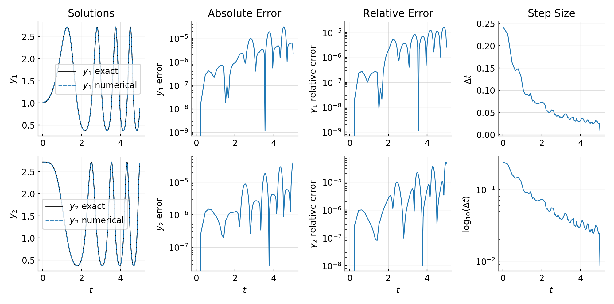
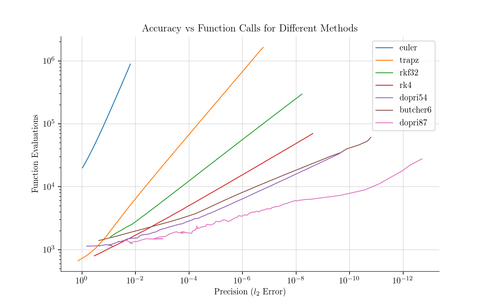
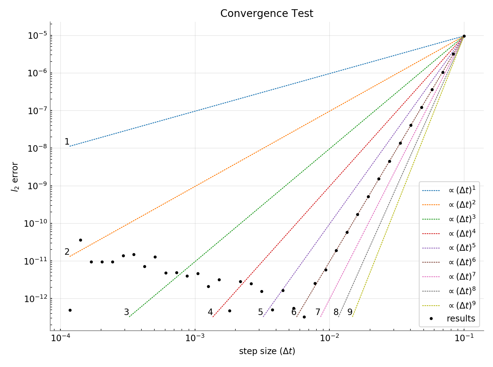

# libode

| Reference | Status | Docs |
| --------- | ------ | ---- |
| [](https://zenodo.org/badge/latestdoi/189592373) | [](https://travis-ci.com/markmbaum/libode) | [](https://markmbaum.github.io/libode/) |

Easy to compile, fast ODE integrators as C++ classes

This repo contains a collection of C++ classes for solving systems of ordinary differential equations (ODEs) in autonomous form. Documentation is [here](https://markmbaum.github.io/libode/). All of the solvers are single-step, Runge-Kutta-like methods. There are explicit, adaptive solvers up to the ninth order. The repository also includes Rosenbrock methods, a singly-diagonal implicit Runge-Kutta (SDIRK) method, and several fully implicit Runge-Kutta methods. However, only a few of the implicit methods have solid adaptive time steppers at this point. With the current collection of solvers and features, `libode` is well suited to any non-stiff systems and to stiff systems that are tightly coupled and have a known Jacobian (ones that don't require sparse or banded matrix routines). It's been useful for solving the same system a huge number of times with varying parameters, when the speed advantage of parallel C++ might be worth it.

The classes were originally styled after [Chris Rycroft](https://people.seas.harvard.edu/~chr/)'s [example classes](https://github.com/chr1shr/am225_examples/tree/master/1a_ode_solvers). Their structure makes it easy to build a templated integrator on top of an arbitrary solver class and switch the solver/method. Implicit methods can be given a function for the ODE system's Jacobian or, if none is provided, the Jacobian is estimated using finite differences.

Several of the solvers and lots of details on the methods can be found in these amazing books:
* Hairer, E., Nørsett, S. P. & Wanner, G. Solving Ordinary Differential Equations I: Nonstiff Problems. (Springer-Verlag, 1987).
* Hairer, E. & Wanner, G. Solving Ordinary Differential Equations II: Stiff and Differential-Algebraic Problems. (Springer, 1996).

The table below lists all the solvers and gives some basic information about them. All of the solvers can be used with a customized time step selection function, but those with a built-in adaptive capability are indicated below. Papers and/or links to the derivation or original publication of the methods are often copied in the headers for the solver classes and included in the documentation. Some work still needs to be done to make the implicit methods genuinely useful, and a list of things to implement is in the `todo.md` file.

Method | Class Name | Header File | (ex/im)plicit | built-in adaptive? | stages | order | stability
 --- | --- | --- | --- | --- | --- | --- | ---
Forward Euler | `OdeEuler` | `ode_euler.h` | explicit | no | 1 | 1
Trapezoidal Rule | `OdeTrapz` | `ode_trapz.h` | explicit | no | 2 | 2
Strong Stability-Preserving, Order 3 | `OdeSsp3` | `ode_ssp_3.h` | explicit | no | 3 | 3
Runge-Kutta-Fehlberg 3(2) | `OdeRKF32`| `ode_rkf_32.h` | explicit | yes | 3 | 3
RK4 | `OdeRK4` | `ode_rk_4.h` | explicit | no | 4 | 4
Runge-Kutta 4(3) | `OdeRK43`| `ode_rk_43.h` | explicit | yes | 5 | 4
Cash-Karp | `OdeRKCK` | `ode_rkck.h` | explicit | yes | 6 | 5
Dormand-Prince 5(4) | `OdeDoPri54`| `ode_dopri_54.h` | explicit | yes | 7 | 5
Jim Verner's "most efficent" 6(5) | `OdeVern65` | `ode_vern_65.h` | explicit | yes | 9 | 6
Jim Verner's "most efficent" 7(6) | `OdeVern76` | `ode_vern_76.h` | explicit | yes | 10 | 7
Dormand-Prince 8(7) | `OdeDoPri87` | `ode_dopri_87.h` | explicit | yes | 13 | 8
Jim Verner's "most efficent" 9(8) | `OdeVern98` | `ode_vern_98.h` | explicit | yes | 16 | 9
Rosenbrock 4(3) | `OdeGRK4A` | `ode_grk4a.h` | implicit | yes | 4 | 4 | A
Rosenbrock 6 | `OdeROW6A` | `ode_row6a.h` | implicit | no | 6 | 6 | A
Backward Euler | `OdeBackwardEuler` | `ode_backward_euler.h` | implicit | no | 1 | 1 | L
Gauss 6th Order | `OdeGauss6` | `ode_gauss_6.h` | implicit | not yet | 3 | 6 | A
Lobatto IIIC 6th Order | `OdeLobattoIIIC6` | `ode_lobatto_iiic_6.h` | implicit | not yet | 4 | 6 | L
Radau IIA 5th Order | `OdeRadauIIA5` | `ode_radau_iia_5.h` | implicit | not yet | 3 | 5 | L
Geng's Symplectic 5th Order | `OdeGeng5` | `ode_geng_5.h` | implicit | no | 3 | 5 | A?
SDIRK 4(3) | `OdeSDIRK43` | `ode_sdirk_43.h` | implicit | yes | 4 | 4 | L

## Compiling

#### Short Instructions

1. Set your compiler and flags by defining `CXX` and `CFLAGS` environment variables or by uncommenting and editing those variables in the config.mk file.
2. Run `make` in the top directory where the Makefile is.
3. If anything weird happens, tell me.
4. Run `make tests` and execute the `run_tests.sh` script to check that things are working.
5. If you want, also execute `run_examples.sh` to run some example solvers (Python with numpy and matplotlib are needed for plotting). To do this, you must have the `CXX` and `CFLAGS` variables active in the config.mk file.
6. Create derived classes and link to the library with `-I<path>/libode/src -L<path>/libode/bin -lode`, replacing `<path>` with the path to the directory above `libode` on your computer.

#### Longer Instructions

`libode` is meant to provide straightforward access to class-based ODE solvers without dependencies or specialized compiling processes. The library is free-standing and there is only one step to take before simply running the Makefile and being done with it. Consequently, the library is also slim on features and doesn't provide things like sparse matrices and dense output. For many systems of ODEs, though, `libode` should make it easy to build an integrator and enjoy the speed of C++ and [openmp](https://en.wikipedia.org/wiki/OpenMP) without the headaches of large, complex packages.

First, before any of the `libode` classes can be compiled, you must tell the Makefile which compiler and compiler flags to use. This can be done two ways. First, you can set the environment variables `CXX` and `CFLAGS`. For example, in the shell:
```shell
CXX=g++
CFLAGS=-Wall -O3
```
Then the Makefile will use the `g++` compiler and always include the `-Wall` and `-O3` flags. Second, you can uncomment and edit variables in the `config.mk` file.  Editing `config.mk` is required if you want to run the `run_examples.sh` script, which solves and plots some example systems of ODEs.

Then simply run `make` and everything should compile.

The Makefile compiles all of the necessary code into the `obj` folder, then archives it in the `bin` directory as a file called `libode.a`. To use the solvers, you can link `libode.a` or the object files directly (in the `obj` directory) when compiling your derived class. You must also include the appropriate header files from the `src` directory, as there is no unified header file for the library. All of the classes have their header file name displayed in the documentation and in the table above. Linking the solver classes requires something like

`-I<path>/libode/src -L<path>/libode/bin -lode`

when compiling derived code, with `<path>` replaced by path elements leading to the libode directory. For some examples of how to link a derived class to `libode` and create a program to run integrations, see the examples folder.

Test programs are compiled with `make tests` and they can all be run in sequence with the `run_tests.sh` script.

## Examples

Several example programs for interesting/famous systems of ODEs are in the examples folder. In each of the example directories, the programs can be compiled, executed, and plotted simply by running the `run.sh` script (assuming the `config.mk` file is set up and an up-to-date version of Python is installed on your computer with numpy, scipy, and matplotlib). These programs are good examples of how to put everything together and use the solvers. To run all the examples in sequence and look at the plotted results, run the `run_examples.sh` script.

## Using the Solvers

#### Define a Class

To integrate a specific system of ODEs, a new class must be created to inherit from one of the solver classes. This new inheriting class must
1. Define the system of ODEs to be solved by implementing the `ode_fun()` function. This is a virtual function in the base classes. Once implemented, it's used by the stepping and solving functions.
2. Set initial conditions using the `set_sol()` function. This can be done inside the new class's constructor, or not.
3. Optionally implement the `ode_jac()` function for implicit methods. This is also a virtual function in the base classes. If it's not overridden but is needed, a (crude) finite-difference estimate of the Jacobian is used.

For flexibility, the derived class can be a template, so that the solver/method can be chosen when the class is constructed. Other than defining the system of equations and setting initial conditions, the derived class can store whatever information and implement whatever other methods are necessary. This could be something simple like an extra function for setting initial conditions. It could, however, comprise any other system that needs to run on top of an ODE solver, like the spatial discretization of a big PDE solver.

#### Call an Integration Function

Each solver has a `step()` method that can be used to integrate a single step with a specified step size. Each solver class also has a `solve_fixed()` method and, if its `dt_adapt()` function is implemented, a `solve_adaptive()` method. These functions return nothing and both have the same four call signatures:

1. `void solve_fixed (double tint, double dt, bool extras)`

   Simply advances the solution for a specified length of the independent variable. The independent variable is assumed to be time, so `tint` is the integration time and `dt` is the time step to use (or the initial time step for adaptive solves). The `extra` argument switches on/off the "extra" functions, which are discussed below.

2. `void solve_fixed (double tint, double dt, const char *dirout, int inter)`

   Integrates for a duration of `tint` using time step (or initial time step) `dt` and writes solution values after every `inter` steps to the directory `dirout`. For example, if `inter` is one, the solution at every step is stored then written to file after the integration finishes. If `inter` is two, every other step is written.

3. `void solve_fixed (double tint, double dt, unsigned long nsnap, const char *dirout)`

   Integrates and writes `nsnap` even spaced snapshots of the solution into the directory `dirout`.

4. `void solve_fixed (double dt, double *tsnap, unsigned long nsnap, const char *dirout)`

   Integrates and writes snapshots at the times specified in `tsnap` into the directory `dirout`.

If these functions aren't enough, you can always write your own and call the `step()` function directly.

**All output files** are written as double precision (64 bit) binary files. These can easily be read by, for example, python's `numpy.fromfile` function or matlab's `fread` function. Then the results can be analyzed and plotted.

#### Flexibly Adapt the Time Step

Some of the solvers have built-in adaptive time steppers. They automatically choose time steps by comparing the solution for a single step with that of an embedded, lower order solution for the step and computing an error estimate. The algorithm for this is well described in the books referenced above. If, however, there is another way that the time step should be chosen for a system, a new selection algorithm can be used with **any** of the solvers. If the virtual function `dt_adapt()` is overridden, it will be used to select the time step in the `solve_adaptive()` functions.

Rejecting an adaptive step is easy. During an adaptive solve, the virtual `is_rejected()` function is called after every step. If it returns `true`, the step is rejected. If it returns `false`, the step is accepted. Either way, `dt_adapt()` computes the next time step size and the solver proceeds. So, at minimum, an adaptive solver with time step rejection needs to have its `dt_adapt()` and `is_rejected()` functions implemented. The embedded Runge-Kutta methods have these functions built in, but they can be overridden.

If it's easier to compute the next time step and determine whether the step is rejected all at once, the virtual `adapt()` function can be implemented. It should store the next time step and store a boolean for rejection. Then `dt_adapt()` and `is_rejected()` simply return those stored values. This is how the embedded Runge-Kutta methods are structured because the same information determines the next step size and rejection/acceptance of the current step.

The point is to make time step selection totally flexible if the embedded Runge-Kutta algorithm isn't suitable. For example, this flexibility has been used to set the time step based on stability thresholds of PDE discretizations like the CFL condition for advection or the von Neumann condition for simple diffusion schemes. Prescribing the adaptive time step based on these conditions, then using `solve_adaptive()`, can provide huge speed boosts.

#### "Extra" Functions During Solves

There is a straightforward way to supplement the built-in solver functions and execute extra code at different points during solves. There are five "extra" functions, which are empty virtual functions that can be overridden by the derived class:

1. `before_solve ()`

   Executed at the beginning of any `solve_fixed()`/`solve_adaptive()` call.

2. `after_step (double t)`

   Executed after every step while the solve function is running. The `t` input is the current "time" of the system, or the value of the independent variable. Although the system must be in autonomous form, the classes track the independent variable as a convenience.

3. `after_capture (double t)`

   Executed each time the state of the system is captured during the second version of `solve_fixed()`/`solve_adaptive()` above (the one with the `inter` argument). This function is similar to `after_step()`, but if the output interval is greater than one, it is only called when output is stored. The `t` input is the current "time" of the system, or the value of the independent variable. Although the system must be in autonomous form, the classes track the independent variable as a convenience.

4. `after_snap (std::string dirout, long isnap, double t)`

   Executed after every snapshot in the solver functions that use snapshot output (call signatures 3 and 4 above). `dirout` is the output directory and `isnap` is the snapshot count (starting from 0). The `t` input is the current "time" of the system, or the value of the independent variable.

5. `after_solve ()`

   Executed at the end of any `solve_fixed()`/`solve_adaptive()` call.

These functions are meant to be very general. They can be used to implement a customized output/storage procedure, print updates, set and reset system variables, or anything else. If they are not overridden, they will do nothing.

## Testing

The convergence and accuracy of all the solvers have been tested using a few programs with source files in the "tests" directory and executables named `bin/test_*`. Python scripts to plot the output of these programs are named `scripts/plot_*`. All these tests can be compiled, run, and plotted with the `run_all_tests.sh` script. Individual tests can be run through the `test.sh` script. For example,
```
./test.sh adapt
```
will compile and run the `test_adapt.exe` program, then plot the results (assuming Python and matplotlib are available). The image below shows the results of this program using the adaptive, fifth order `OdeDoPri54` class to solve a system of two coupled oscillators.


The `test_work` program examines how many function evaluations (the number of times the system of ODEs is evaluated) are required for different levels of accuracy for several methods. Each method solves an identical initial value problem and the final values are compared to a known solution. The plot below, generated by running
```
./test.sh work
```
shows the results. As expected, but still amazingly, the eighth order method of Dormand and Prince (`OdeDoPri87`) achieves error reduction by a factor of about 100,000,000 when the number of function calls is increased by a factor of 10.



Another test program, `test_conv`, can be used to confirm the order of accuracy of different methods. Below are the results for the sixth order, fully-implicit Lobatto IIIC method. The black dots fall neatly along a line proportional to the sixth power of the step size until machine precision is reached for the global error, confirming the expected order of accuracy.


